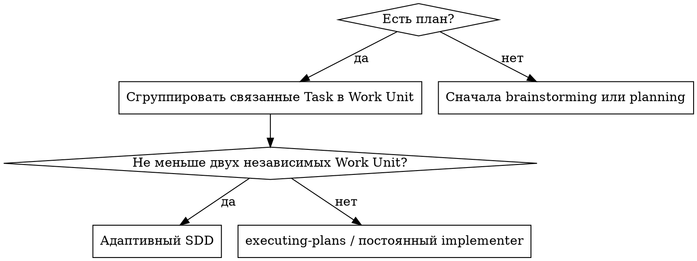
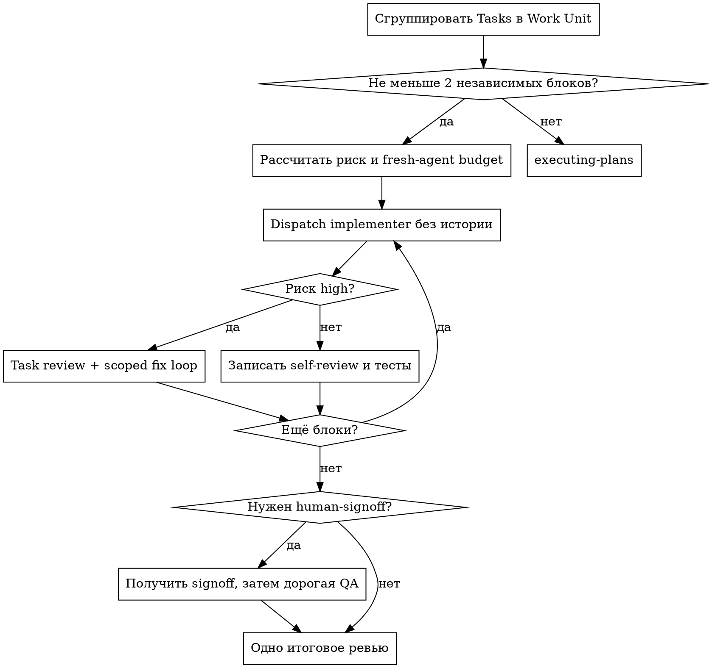

# Адаптивный Subagent-Driven Development

Исполняй план через изолированных implementer, но создавай агентов и
независимые review gates только там, где граница работы и риск это
оправдывают.

**Основной принцип:** рабочий блок — это минимальное изменение, которое
можно независимо реализовать, протестировать и отклонить. Заголовок `Task`
в плане не обязан быть рабочим блоком.

**Краткая коммуникация:** между tool calls сообщай только значимый этап,
риск или решение. Ledger и файлы отчётов хранят подробности.

**Непрерывное исполнение:** не спрашивай «продолжать ли?» между рабочими
блоками. Останавливайся только при неустранимом blocker, реальной
неоднозначности, необходимости превысить согласованный бюджет агентов или
на обязательном human-signoff для субъективного артефакта.

## 1. Проверка применимости

До первого dispatch прочитай план один раз и сгруппируй его задачи в
`Work Unit`.

Объединяй смежные задачи, если выполняется хотя бы одно условие:

1. Более половины задач плана меняют один основной артефакт или один набор
   файлов.
2. Следующая задача зависит от точной формы результата предыдущей и не
   может быть независимо принята reviewer.
3. Разделение отражает этапы создания, наполнения, полировки или
   синхронизации одного пользовательского артефакта.

Не объединяй задачи только из-за соседства. Граница `Work Unit` существует,
если reviewer может отклонить этот блок, не отклоняя соседний.

После группировки для SDD нужны **минимум два независимых рабочих блока**.
Если остался один связный блок, не запускай SDD: сообщи о маршрутизации и
используй `executing-plans` либо одного постоянного implementer. Это не
ошибка плана — просто изоляция свежими агентами здесь не окупается.



## 2. Предварительная карта и бюджет

Для каждого `Work Unit` запиши:

- номера входящих Tasks;
- независимо проверяемый результат;
- зависимости от предыдущих блоков;
- риск: `normal` или `high`;
- обязательные тесты;
- нужен ли human-signoff до дорогой QA.

### Классификация риска

`high` ставится при наличии хотя бы одного наблюдаемого признака:

- безопасность, аутентификация или авторизация;
- миграция данных, разрушительная либо необратимая операция;
- публичный API или формат данных, используемый вне изменяемого модуля;
- конкурентность, синхронизация или распределённое состояние;
- архитектурное либо сквозное изменение нескольких подсистем;
- последующие блоки непосредственно строятся на корректности этого блока.

Контент, документация, механическая конфигурация, изолированное небольшое
изменение и субъективная полировка по умолчанию имеют риск `normal`.
Не повышай риск только потому, что diff большой.

До первого агента рассчитай и запиши в ledger:

```text
fresh-agent budget:
  implementers = <число Work Unit>
  task-reviewers = <число high-risk Work Unit>
  final-reviewers = 1
  total = implementers + task-reviewers + final-reviewers
```

Повторное сообщение живому implementer/reviewer не расходует новую позицию
бюджета. Всегда предпочитай `followup_task` исходному агенту. Если агент
недоступен или задача требует нового уровня способности, перед созданием
замены пересчитай бюджет, попробуй объединить волну исправлений и сообщи
пользователю причину превышения. Не создавай дополнительные пары молча.

## 3. Изоляция контекста и выбор модели

Каждый **новый** агент получает явно:

```yaml
fork_turns: "none"
model: "<модель, выбранная по сложности роли>"
```

Не полагайся на значения dispatch по умолчанию: наследование полной истории
делает каждый последующий turn дороже и переносит нерелевантные решения.

В prompt передавай:

1. одну строку о месте блока в проекте;
2. пути к task brief;
3. только интерфейсы и решения предыдущих блоков, нужные этому блоку;
4. путь к report или review package;
5. короткий контракт ответа.

Не вставляй полный план, историю сессии, прежние отчёты или diff в prompt.
Полный ответ агент записывает в файл; в чат возвращает статус, commits,
одну строку тестов и concerns.

### Модель

- Полностью заданные механические изменения в 1–2 файлах: дешёвая модель.
- Интеграция нескольких файлов и отладка: стандартная модель.
- Архитектура и итоговое ревью ветки: наиболее способная модель.
- Reviewer: уровень по риску и сложности diff, но не ниже средней модели
  для выводов из прозаических требований.

Число turns важнее номинальной цены токена. Не назначай дешёвую модель
многошаговой интеграции, если она будет многократно перечитывать контекст.

## 4. Workspace и ledger

Проверь изолированный worktree через `using-git-worktrees`. Не начинай
реализацию на `main`/`master` без явного разрешения пользователя.

Для плана получи workspace:

```bash
scripts/sdd-workspace PLAN_FILE
```

Первой строкой ledger должно быть:

```text
# SDD ledger — plan: <путь к плану>
```

Затем запиши карту и бюджет:

```text
Work Unit 1: tasks 1,2,3; risk normal; state pending
Work Unit 2: tasks 4,5; risk high; state pending
fresh-agent budget: implementers=2, task-reviewers=1, final-reviewers=1, total=4
```

Ledger переживает compaction. После потери контекста доверяй ему и
`git log`: не переотправляй завершённые блоки.

До исполнения одним проходом найди противоречия между Tasks, глобальными
ограничениями и review rubric. Если они есть, задай пользователю один
пакетный вопрос.

## 5. Цикл рабочего блока

Никогда не запускай несколько implementer параллельно в одном worktree.

### 5.1 Подготовить brief

Для каждой Task внутри блока выполни:

```bash
scripts/task-brief PLAN_FILE TASK_NUMBER
```

Передай implementer список полученных путей как `[BRIEF_FILES]`. Не склеивай
их в prompt. Один report на весь блок:

```text
<workspace>/work-unit-<N>-report.md
```

Перед dispatch сохрани `BASE=$(git rev-parse HEAD)`.

Используй [implementer-prompt.md](implementer-prompt.md). Новый dispatch
обязан содержать `fork_turns: "none"` и явную модель.

### 5.2 Обработать статус

- `DONE`: implementer реализовал блок, протестировал, закоммитил и
  самопроверил.
- `DONE_WITH_CONCERNS`: сначала оцени concerns; сомнение в корректности
  устрани до перехода дальше.
- `NEEDS_CONTEXT`: дай только недостающий контекст и продолжи того же агента.
- `BLOCKED`: измени контекст, модель или границу блока; дефект плана вынеси
  пользователю.

Не заставляй того же агента повторять попытку без изменения условий.

### 5.3 Выбрать review gate

Для `normal`:

1. проверь, что report содержит тесты и self-review;
2. получи список изменённых lock-файлов через
   `git diff --name-only BASE HEAD`;
3. для каждого lock-файла проверь в секции
   `Excluded-content validation` точную детерминированную команду, успешный
   результат и commit `HEAD`, на котором она выполнялась;
4. report без актуального доказательства верни исходному implementer;
5. запиши `Work Unit <N>: task-review skipped — normal risk`;
6. переходи к следующему блоку.

Для `high`:

1. сформируй пакет:

   ```bash
   scripts/review-package PLAN_FILE BASE HEAD
   ```

2. до dispatch примени к lock-файлам тот же
   `Excluded-content validation` gate, что и для `normal`;
3. передай reviewer список brief, report, package и глобальные ограничения;
4. используй [task-reviewer-prompt.md](task-reviewer-prompt.md).

Implementer self-review обязателен для всех блоков. Независимый task-review
обязателен только для `high`; итоговое ревью покрывает все блоки.

Reviewer не повторяет тесты, уже выполненные на том же commit и приведённые
в report. Он запускает только узкую проверку конкретного сомнения.

### 5.4 Исправить важные замечания

Fix loop открывается только для:

- провала spec compliance;
- Critical или Important;
- `Cannot verify`, который контроллер подтвердил как реальный пробел.

Minor запиши в ledger для итогового reviewer. Не запускай ради него отдельную
волну.

Одним `followup_task` передай исходному implementer все открытые замечания.
Он исправляет их одной волной, повторяет покрывающие тесты и дописывает тот
же report.

Сформируй scoped package `FIX_BASE..HEAD` и продолжи **того же reviewer**,
передав [re-review-prompt.md](re-review-prompt.md). Новый reviewer допустим
только если старый недоступен; это изменение fresh-agent budget.

По умолчанию максимум три fix round. Если после третьего остаётся
load-bearing дефект, остановись и сообщи пользователю. Спорное или
некритичное замечание можно park только с явным ruling в ledger. Продление
до пяти раундов требует согласованного превышения бюджета.

### 5.5 Завершить блок

Запиши один из вариантов:

```text
Work Unit <N>: complete (commits <base7>..<head7>, task-review skipped — normal risk)
Work Unit <N>: complete (commits <base7>..<head7>, high-risk review clean)
Work Unit <N>: complete (commits <base7>..<head7>, <K> parked with rulings)
```

Не переходи дальше с открытым Critical/Important.

## 6. Human-signoff для субъективных артефактов

Презентации, UI, документы, тексты и другие human-visible артефакты требуют
особого шлюза:

1. implementer выполняет дешёвые проверки целостности;
2. пользователь видит содержание или preview;
3. контроллер получает явный human-signoff;
4. только после этого запускаются полный browser/export/visual-review и
   итоговое ревью.

Если обратная связь пришла во время reviewer:

1. прерви устаревшего reviewer;
2. признай его package устаревшим;
3. объедини все пользовательские правки и синхронизацию производных файлов
   в существующий `Work Unit`;
4. продолжи исходного implementer;
5. после нового signoff выполни одну финальную QA и итоговое ревью.

Не создавай отдельную task/review-цепочку для speaker notes, README или
другого файла, который лишь синхронизирует тот же пользовательский артефакт.

## 7. Ограниченный review package

`scripts/review-package` по умолчанию ограничен `200 KiB`. Он сохраняет
commit list и общую stat, но заменяет манифестом:

- lock-файлы;
- binary;
- `*.min.js`, `*.min.css`, source maps;
- содержимое `dist/`, `build/`, `coverage/` и файлы `*.generated.*`,
  `*.gen.*`.

Манифест содержит путь, категорию, размер результата в `HEAD`, SHA-256 и
numstat. Это позволяет reviewer увидеть масштаб и проверить конкретный файл
отдельно при названном риске, не загружая его автоматически.

Lock-файл должен быть проверен package manager, сборкой или другой
детерминированной командой в секции `Excluded-content validation` отчёта
implementer. Запись содержит путь, команду, результат и проверенный commit
`HEAD`. Манифест не является доказательством валидности.

Обычный исходный код никогда не усекается молча. Если пакет превышает
предел, скрипт завершается кодом `4`: сузь `Work Unit` или сформируй
несколько явных пакетов. Не увеличивай предел только ради обхода защиты.

Для обоснованного исключения предел можно задать явно:

```bash
SDD_REVIEW_PACKAGE_MAX_BYTES=<байты> scripts/review-package PLAN BASE HEAD
```

Причину переопределения запиши в ledger.

## 8. Ожидание агентов

Используй самый длинный уместный bounded wait, но не блокируй один вызов
дольше 60 секунд. После тайм-аута:

- не пересказывай неизменившееся состояние;
- не запускай дублирующего агента;
- не делай частые пустые heartbeat;
- проверь только новый результат или продолжи полезную локальную работу.

Пользователь получает обновление о завершённом блоке, найденном риске,
необходимом решении или готовом результате.

## 9. Итоговое ревью

После всех блоков и human-signoff выполни **ровно одно итоговое ревью**
ветки.

1. Получи `MERGE_BASE`.
2. Собери `review-package PLAN_FILE MERGE_BASE HEAD`.
3. Запусти одного наиболее способного reviewer с `fork_turns: "none"`.
4. Передай ему package, глобальные ограничения, пути ко всем отчётам
   `[REPORT_FILES]` и deferred/parked строки ledger. Reviewer сверяет
   lock-evidence с актуальным `HEAD`, не повторяя подтверждённую команду.

Если итоговый reviewer нашёл Critical/Important, передай весь список одному
fixer, предпочтительно исходному implementer подходящего блока. После одной
общей fix wave продолжи того же reviewer для одного scoped re-review.
Не создавай fixer на каждое замечание и не запускай второе полное ревью.

Residual load-bearing дефект блокирует завершение. Остальное получает
явный ruling.

После чистого результата удали workspace только данного плана и используй
`finishing-a-development-branch`.

## Карта процесса



## Частые рационализации

| Рационализация | Почему неверно |
|---|---|
| «В плане семь Tasks, значит нужны семь implementer» | Task — единица документа, а не автоматически независимый `Work Unit`. |
| «Reviewer после каждого шага всегда безопаснее» | Для normal-risk связанных изменений это повторное чтение одного контекста; итоговое ревью уже покрывает их. |
| «Пусть новый агент унаследует историю, там всё есть» | Он повторно читает нерелевантные миллионы токенов; передай пути и необходимые интерфейсы. |
| «Запущу визуальную QA до показа пользователю» | Пользовательская правка обесценит весь проверенный снимок. Сначала human-signoff. |
| «Lock-файл нужен reviewer целиком» | Нужны stat, hash и детерминированная проверка; полный diff редко оправдывает сотни KiB. |
| «Создам fixer на каждое замечание» | Каждый fixer заново строит контекст. Исправления одной волны принадлежат одному агенту. |
| «Тайм-аут означает, что агент завис» | Это только отсутствие нового результата; не дублируй работу. |
| «Бюджет можно пересчитать после каждого spawn» | Бюджет существует до dispatch и делает рост агентов видимым. |
